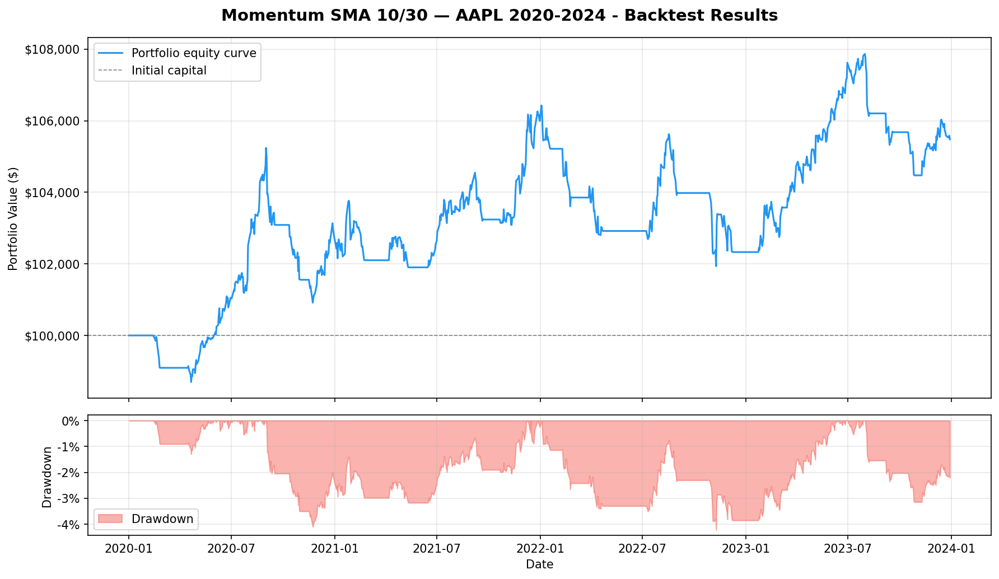

# Algorithmic Trading Backtester

An event-driven algorithmic trading backtester built in Python, designed to simulate realistic trading conditions with slippage, commission, and walk-forward validation.

Built as a portfolio project to demonstrate quantitative finance and software engineering skills relevant to Quant Developer, Trading, and Risk roles.

---

## Architecture

The system is event-driven — meaning it replays historical data one bar at a time and routes events through a queue, mirroring the architecture of live trading systems.
```
MarketEvent → Strategy → SignalEvent → Portfolio → OrderEvent → Broker → FillEvent → Portfolio
```

This design prevents lookahead bias (accidentally using future data) and makes the system easy to extend with new strategies or execution models.

### Project structure
```
backtester/
├── data/               # Market data fetching and validation
│   ├── models.py       # DataBar — immutable OHLCV unit
│   └── fetcher.py      # yfinance wrapper with auto-adjustment
├── engine/             # Core event-driven engine
│   ├── events.py       # MarketEvent, SignalEvent, OrderEvent, FillEvent
│   ├── backtest.py     # Main event loop
│   ├── portfolio.py    # Position tracking and P&L
│   └── broker.py       # Simulated execution with slippage + commission
├── strategies/         # Pluggable trading strategies
│   ├── base.py         # Abstract base class
│   ├── momentum.py     # SMA crossover momentum strategy
│   └── mean_reversion.py # RSI-based mean reversion strategy
├── analytics/          # Performance measurement
│   ├── performance.py  # Sharpe, Sortino, CAGR, max drawdown
│   ├── tearsheet.py    # Console report + equity curve chart
│   ├── walkforward.py  # Walk-forward overfitting detection
│   └── optimizer.py    # Parameter grid search
└── tests/              # 20 pytest unit tests
```

---

## Strategies

### Momentum (SMA Crossover)
Generates a LONG signal when the fast moving average (10-day) crosses above the slow moving average (30-day), indicating upward momentum. Generates a SHORT signal on the reverse crossover.

### Mean Reversion (RSI)
Uses the Relative Strength Index (RSI) to identify oversold (RSI < 30) and overbought (RSI > 70) conditions, betting that extreme price moves revert to the mean.

---

## Performance Analytics

Every backtest produces a full tear sheet including:

| Metric | Description |
|---|---|
| Total return | Raw % gain/loss over the period |
| CAGR | Compound annual growth rate |
| Sharpe ratio | Annualized return per unit of risk (252 trading days) |
| Sortino ratio | Like Sharpe but only penalizes downside volatility |
| Max drawdown | Largest peak-to-trough equity decline |

### Sample result — Momentum SMA 10/30 on AAPL (2020–2024)
```
Total return :   5.48%
CAGR         :   1.35%
Sharpe ratio :   -1.27
Max drawdown :   4.22%
Bars         :   1,006
```



---

## Overfitting Detection

A key feature of this backtester is walk-forward testing — splitting data into rolling in-sample (training) and out-of-sample (test) windows to measure how much performance degrades on unseen data.

A large gap between in-sample and out-of-sample Sharpe ratios indicates the strategy has been overfit to historical data — one of the most common failure modes in algorithmic trading.

---

## Getting started
```bash
git clone https://github.com/lol-itsfab/Backtester.git
cd Backtester
python -m venv venv
venv\Scripts\Activate.ps1       # Windows
pip install -r requirements.txt
pytest tests/ -v
```

---

## Running a backtest
```python
from data.fetcher import fetch_ohlcv
from engine.backtest import BacktestEngine
from strategies.momentum import MomentumStrategy
from analytics.performance import PerformanceAnalyzer
from analytics.tearsheet import print_tearsheet, plot_equity_curve

bars = fetch_ohlcv("AAPL", "2020-01-01", "2024-01-01")
engine = BacktestEngine(bars, MomentumStrategy, initial_capital=100_000)
portfolio = engine.run()

analyzer = PerformanceAnalyzer(portfolio.equity_curve)
print_tearsheet(analyzer, "Momentum SMA 10/30 — AAPL")
plot_equity_curve(analyzer, "Momentum SMA 10/30 — AAPL")
```

---

## Requirements

Generate the requirements file:
```powershell
pip freeze > requirements.txt
```

- Python 3.11+
- yfinance
- pandas
- matplotlib
- pytest

---

## Skills demonstrated

- Event-driven system architecture in Python
- Financial data pipeline with adjusted price handling
- Quantitative indicators: SMA, RSI, Sharpe, Sortino, CAGR, max drawdown
- Overfitting detection via walk-forward validation
- Parameter optimization with grid search
- Unit testing with pytest (20 tests)